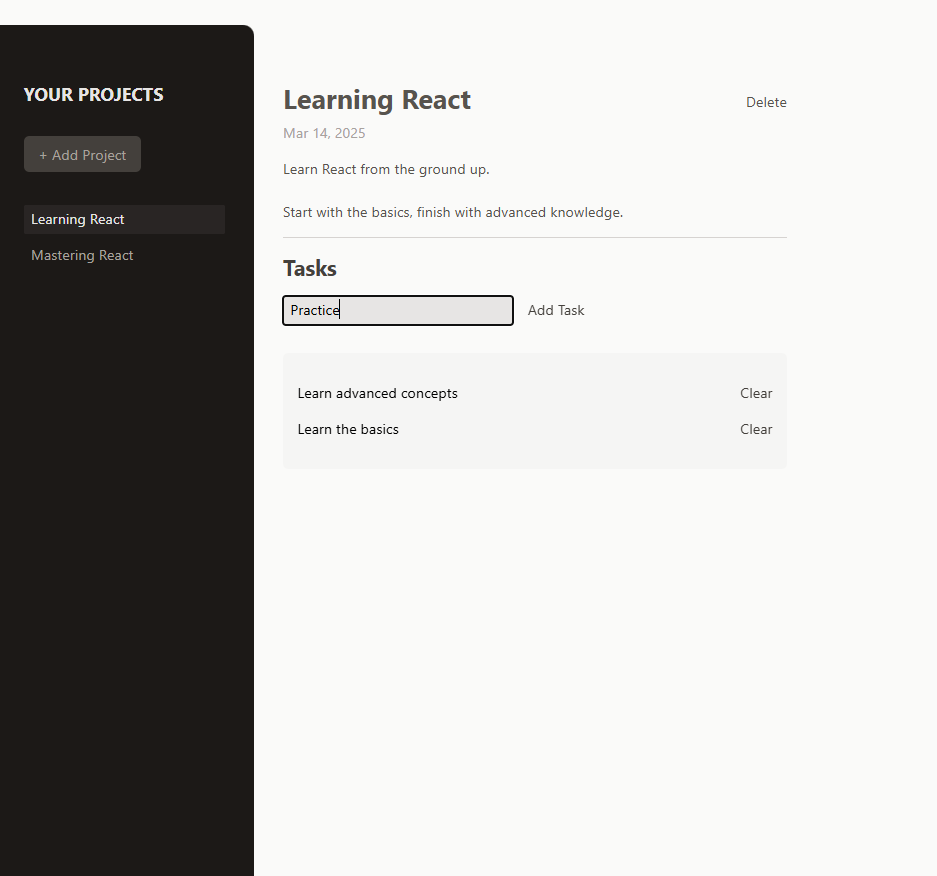

# React Project Manager

This is a React project designed to practice working with refs and portals. 
The game challenges users to stop a timer as close as possible to the target time. 
It demonstrates state management, event handling, refs for managing timers, and portals 
for rendering modals efficiently. This project provides hands-on experience with useRef, 
useImperativeHandle, and React Portals. 
<br><br>


## 🚀 Getting Started

### **Prerequisites**
Make sure you have the following installed before running the project:
- **Node.js** (Download from [nodejs.org](https://nodejs.org/))
- **npm** or **yarn** (Comes with Node.js)
<br>

### **Installation**
1. Clone this repository:
   ```sh
   git clone https://github.com/nathenpriyonggo/react-project-management/
   ```
2. Navigate to the directory
   ```sh
   cd react-project-management
   ```
3. Install dependencies:
   ```sh
   npm install
   ```
4. Start the development server:
   ```sh
   npm run dev
   ```
5. Open ```http://localhost:5173/``` in your browser.
<br>

## 🛠️ Built With
- **React** - A JavaScript library for building user interfaces
- **Vite** - A fast build tool for modern web projects
- **TailwindCSS** - Utility-first CSS framework
- **React Portals** - For rendering modals efficiently
- **useRef & useImperativeHandle** - For managing input fields & modal dialogs
<br>

## 📌 Features
- **Project Creation & Management** – Users can create, edit, and delete projects.
- **Task Management** – Add and delete tasks within a project.
- **Dynamic State Handling** – Uses useState to update projects & tasks dynamically.
- **Ref Management** – Uses useRef for handling form inputs.
- **Modal Dialogs with React Portals** – Displays validation messages in an overlay.
- **Responsive UI** – Built with TailwindCSS for a modern look.
<br>

## 🤔 How It Works
1. Managing Projects
   - Click "+ Add Project" to create a new project.
   - Fill in the title, description, and due date.
   - Click "Save" to add the project.
2. Navigating the Sidebar
   - The left sidebar displays a list of all created projects.
   - Click on a project to view its tasks and details.
   - The currently selected project is highlighted.
   - Remove projects by clicking the DELETE button.
   - Click "+ Add Project" to return to project creation mode.
3. Managing Tasks
   - Select a project from the sidebar.
   - Add new tasks using the input field.
   - Remove tasks by clicking the Clear button.
4. Using Modals & Validation
   - If a project input field is empty, a modal (React Portal) appears with a warning.
   - Click "Okay" to close the modal and re-enter the required values.
<br>


## 🖥️ Preview
<p align="center"></p>
<br>

## 📜 License
This project is open-source. Feel free to modify and expand upon it!
<br><br>


---

✨ Happy coding! 🚀
